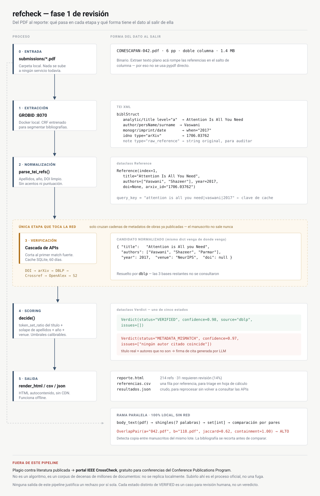

# Conescapan — revisión de referencias

[](https://github.com/JuliobaCR/Conescapan-revision-de-referencias/actions/workflows/ci.yml)
[](https://www.python.org/)
[](LICENSE)

Verificación automática de bibliografías para el triage inicial de manuscritos.
Los papers bajo revisión nunca salen de la máquina donde corre esto.



## Qué resuelve

| Necesidad | Cubierta | Cómo |
|---|---|---|
| ¿Las referencias existen? | Sí | Cascada Crossref / DBLP / OpenAlex / Semantic Scholar |
| ¿Los metadatos citados son correctos? | Sí | Comparación de autores, año y venue contra el registro real |
| ¿Hay citas fabricadas por un LLM? | Parcial | Detección de citas quiméricas (título real, autores falsos) |
| ¿Hay copia entre submissions del lote? | Sí | Shingling + containment, sin red |
| ¿Hay plagio de literatura publicada? | **No** | Portal IEEE CrossCheck — ver [Alcance](#alcance) |

## Instalación

```bash
git clone https://github.com/JuliobaCR/Conescapan-revision-de-referencias.git
cd Conescapan-revision-de-referencias

docker compose up -d grobid          # extractor de bibliografías, local
pip install -e .
cp .env.example .env                 # opcional, mejora rate limits

# opcional: LLM local para rescatar referencias que GROBID no pudo parsear
docker compose up -d ollama
docker compose exec ollama ollama pull qwen2.5:7b-instruct
```

## Uso

```bash
set -a && source .env && set +a
refcheck ./submissions --out ./reporte
```

Salidas en `reporte/`: `reporte.html` (dashboard autocontenido, funciona
offline — KPIs, gráfico de distribución por estado, y un listado de papers
filtrable/buscable con comentario automático por manuscrito), `papers.csv`
(una fila por paper — la vista de "qué reviso primero"), `referencias.csv`
(una fila por referencia, para triage fino) y `resultados.json` (crudo, para
reprocesar sin volver a consultar las APIs).

`refcheck` busca PDFs recursivamente dentro de `input/` — soporta exports de
sistemas de revisión con estructura `<N>/Submission/archivo.pdf`, y en ese
caso usa `N` como ID del paper en el reporte en vez del nombre de archivo.

| Opción | Default | Para qué |
|---|---|---|
| `--out` | `reporte` | Carpeta de salida |
| `--grobid` | `http://localhost:8070` | URL del servicio GROBID |
| `--cache` | `refcheck_cache.db` | Cache SQLite de resultados de verificación (APIs) |
| `--extract-cache` | `refcheck_extract_cache.db` | Cache SQLite de qué extrajo GROBID/regex de cada PDF — una corrida repetida no vuelve a mandar todo el batch a GROBID, solo lo que cambió o falló |
| `--no-extract-cache` | — | Ignorarla y re-extraer todo (por si cambiaste algo en `extract.py`) |
| `--workers` | `3` | Papers en paralelo — subilo con cuidado, el rate limit de las APIs es compartido |
| `--no-overlap` | — | Omite el cruce entre manuscritos |
| `--llm-rescue` | — | Usa un LLM local (Ollama) para rescatar referencias `UNPARSEABLE`. Nunca decide si la obra existe, solo reformatea el string crudo en JSON — la verificación real sigue corriendo contra Crossref/DBLP/OpenAlex/S2 |
| `--ollama-url` | `http://localhost:11434` | URL del servicio Ollama |
| `--ollama-model` | `qwen2.5:7b-instruct` | Modelo a usar para el rescate |

## Estados de verificación

| Estado | Significado | Acción |
|---|---|---|
| `VERIFIED` | Existe y los metadatos coinciden | Ninguna |
| `METADATA_MISMATCH` | La obra existe pero autores, año o venue no corresponden | **Revisar** — firma típica de una cita generada por LLM |
| `POSSIBLE_MATCH` | Coincidencia parcial de título | Revisar — suele ser parseo defectuoso, no fraude |
| `NOT_FOUND` | Ninguna base la reconoce | Revisar — puede ser legítima y no indexada |
| `UNPARSEABLE` | No se extrajo título ni identificador | Revisar el PDF a mano |

## Privacidad

De todo el pipeline, una sola etapa abre un socket: la verificación. Lo que la
cruza son cadenas de metadatos de obras **ya publicadas** (`"attention is all
you need|vaswani|2017"`). El texto del manuscrito, los nombres de sus autores y
el PDF completo se quedan en el servidor.

El `.gitignore` excluye `submissions/`, `reporte/` y cualquier `*.pdf` fuera de
`docs/`. No commitees manuscritos bajo revisión.

## Desarrollo

```bash
pip install -e ".[dev]"
pytest              # 21 tests, sin red, <1s
pytest -m network   # integración real contra Crossref (opt-in)
ruff check refcheck tests
```

Los tests de red quedan fuera del CI a propósito: un outage de Crossref no
debería romper el build.

## Calibración

Los umbrales viven en `refcheck/verify.py` (`T_STRONG`, `T_WEAK`,
`YEAR_TOLERANCE`, `SHORT_TITLE_WORDS`) y `refcheck/dedupe.py` (`JACCARD_FLAG`,
`CONTAINMENT_FLAG`).

Antes de usarlo en producción, corré 20–30 papers ya revisados a mano y ajustá
hasta que la tasa de flags sea manejable para el comité. Sin esa calibración
vas a entregar una lista donde el 85% es ruido, y los revisores van a dejar de
abrirla en la segunda semana. Ese es el modo de falla real de estas
herramientas, no la precisión del algoritmo.

## Alcance

**Ninguna salida de esta herramienta justifica un rechazo por sí sola.** Las
bases bibliográficas son incompletas y sesgadas hacia el inglés: normas IEEE,
reportes técnicos, tesis, libros, actas de congresos regionales y trabajos en
español aparecen mal indexados o directamente no aparecen. Un `NOT_FOUND` en un
paper centroamericano que cita literatura local es el caso esperado. Cada flag
es un caso para revisión humana; si alguien del comité va a contactar a los
autores, debe haber verificado la referencia a mano primero.

**El plagio contra literatura publicada está fuera de este pipeline.** No es un
algoritmo, es un corpus: iThenticate compara contra fuentes de internet más
decenas de millones de documentos full-text aportados por miembros de Crossref,
y eso no se replica en un servidor propio. El portal IEEE CrossCheck está
disponible sin costo para organizadores de conferencias inscritas en el
Conference Publications Program, y la política de IEEE ya exige que todo paper
aceptado se revise por plagio. Subir los manuscritos ahí no es una fuga: es el
proceso oficial que los autores aceptan al someter. Coordinarlo con el
Publications Chair. No hay API pública, así que ese paso es manual.

**No se incluye detección de "texto generado por IA"** y no debería agregarse.
Las tasas de falsos positivos son altas y penalizan sistemáticamente a quienes
no escriben en inglés nativo — en una conferencia de Región 9, la mayoría de
los autores.

## Roadmap

- [x] Rescate de referencias `UNPARSEABLE` con un LLM local (Ollama): pasarle el
      string crudo y pedirle JSON estructurado. Nunca preguntarle si la obra existe.
      Ver `--llm-rescue` y [`refcheck/llm_rescue.py`](refcheck/llm_rescue.py).
- [ ] Referencias huérfanas vía `process_fulltext`: entradas en la bibliografía
      que nunca se citan, y `[n]` en el cuerpo sin entrada correspondiente.
- [ ] MinHash + LSH si el lote supera los ~1000 manuscritos.
- [ ] Reporte por track, para repartir el triage entre los chairs.

## Licencia

MIT — ver [LICENSE](LICENSE).
